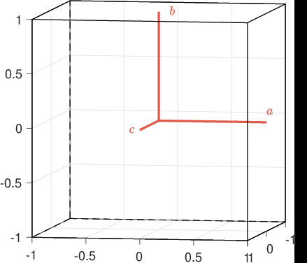

# Permanent magnet synchronous motor modeling

------

[PMSM Description](/PMSM.md)

- [PMSM Modeling](PMSMModeling.html)
- [PMSM Control](PMSMControl.html)

------

### Classical $abc$ frame

\begin{equation}

\label{eq:modeleabc}

\left\{\begin{array}{rcl}

L \frac{di_{a}}{dt} & = & v_{a}-R i_{a}+ p \phi_f  \Omega \sin(p\theta)\\\\

L \frac{di_{b}}{dt} & = & v_{b}-R i_{b}+ p \phi_f  \Omega \sin\left(p\theta-\frac{2\pi}{3}\right)\\\\

L \frac{di_{c}}{dt} & = & v_{c}-R i_{c}+ p \phi_f  \Omega \sin\left(p\theta+\frac{2\pi}{3}\right)\\\\

J\frac{d\Omega}{dt} &=& \tau_m-\tau_l \\\\

{\frac{d\theta}{dt}} &=& \Omega\\

\end{array}\right.

\end{equation}

where  $i_{abc} = \left[\begin{matrix}i_a & i_b & i_c\end{matrix}\right]^\intercal$ are the stator phase currents, $v_{abc} = \left[\begin{matrix}v_a & v_b & v_c\end{matrix}\right]^\intercal$ the stator phase voltages, $\Omega$ and $\theta$ are the speed and position respectively and $p$ the pole pair number. $L$ and $R$ and the staotr inductance and resistor, $\phi_f$ the flux constant. $\tau_r$ the resistive torque and $\tau_m$ the motor torque.

\begin{equation}

\tau_m = -p\phi_f  \left[i_a\sin(p\theta) + i_b\sin\left(p\theta-\frac{2\pi}{3}\right) + i_c\sin\left(p\theta+\frac{2\pi}{3}\right)\right]

\end{equation}

### Clarke and Parc transformations

####  Clarke transformation : 2-phases equivalent representation

Under the assumption of balanced motor one has  $x_a+x_b+x_c = 0$. Motor equations can thus be transformed into a 2-phases equivalent representation using Clarke transformation. 

\begin{equation}

x_{\alpha\beta} = \begin{bmatrix}x_\alpha & x_\beta\end{bmatrix}^\intercal = T_{3\rightarrow2}x_{abc} = T_{3\rightarrow2}\begin{bmatrix}x_a & x_b &x_c\end{bmatrix}^\intercal

\end{equation}

\begin{equation}

T_{3\rightarrow2} = \frac{2}{3}\begin{bmatrix}1 & -\frac{1}{2}& -\frac{1}{2}\\0 & \frac{\sqrt{3}}{2}& -\frac{\sqrt{3}}{2}\end{bmatrix}

\end{equation}

\begin{equation}

\label{eq:modeleab}

\left\{\begin{array}{rcl}

L \frac{di_{\alpha}}{dt} & = & v_{\alpha}-R i_{\alpha}+ p \phi_f  \Omega \sin(p\theta)\\\\

L \frac{di_{\beta}}{dt} & = & v_{\beta}-R i_{\alpha}- p \phi_f  \Omega \cos\left(p\theta\right)\\\\

J\frac{d\Omega}{dt} &=& \tau_m -\tau_r \\\\

{\frac{d\theta}{dt}} &=& \Omega\\

\end{array}\right.

\end{equation}

\begin{equation}

\tau_m = p\frac{3}{2}\phi_f  \left[-i_\alpha\sin(p\theta) + i_\beta\cos(p\theta)\right]

\end{equation}

#### Park transformation : $d-q$ rotating frame 

In the previous model, votages and currents varies at high frequency (p times the rotational frequency). To avoid sinus terms Park transformation is used (Par29).

La transformée de Park est obtenue à partir de la matrice de rotation $R(\theta)$ liant les axes $\alpha\beta$ aux axes $dq$. On a

\begin{equation}

\label{eq:park}

x_{dq} = R(\theta) x_{\alpha\beta} = \left[

​		\begin{matrix}

​			\cos(p\theta) & \sin(p\theta)\\

​			-\sin(p\theta) & \cos(p\theta)

​		\end{matrix}

​	\right]x_{\alpha\beta}

\end{equation}

\begin{equation}

\label{eq:invpark}

x_{\alpha\beta} = R(\theta)^{-1} x_{dq} =\left[

​		\begin{matrix}

​			\cos(p\theta) & -\sin(p\theta)\\

​			\sin(p\theta) & \cos(p\theta)

​		\end{matrix}

​	\right]x_{dq}

\end{equation}

Le modèle \eqref{eq:modeleab} dans le repère $dq$ s'écrit

\begin{equation}

\label{eq:modeledq}

\left\{\begin{array}{rcl}

L \frac{di_d}{dt} & = & v_d-R i_d + Lp\Omega i_q\\\\

L \frac{di_q}{dt} & = & v_q-R i_q - Lp\Omega i_d -\phi_f  p\Omega\\\\

J\frac{d\Omega}{dt} &=& \tau_m -\tau_r \\\\

{\frac{d\theta}{dt}} &=& \Omega\\

\end{array}\right.

\end{equation}

\begin{equation}

\tau_m = p\frac{3}{2}\phi_f  i_q

\end{equation}

## References :

(Par29) Park, R.-H. (1929). Two-reaction theory of synchronous machines generalized method of analysis-part I. *Transactions of the American Institute of Electrical Engineers*, *48*(3), 716–727. https://doi.org/10.1109/T-AIEE.1929.5055275

------

[PMSM Description](/PMSM.md)

- [PMSM Modeling](PMSMModeling.html)
- [PMSM Control](PMSMControl.html)

------

